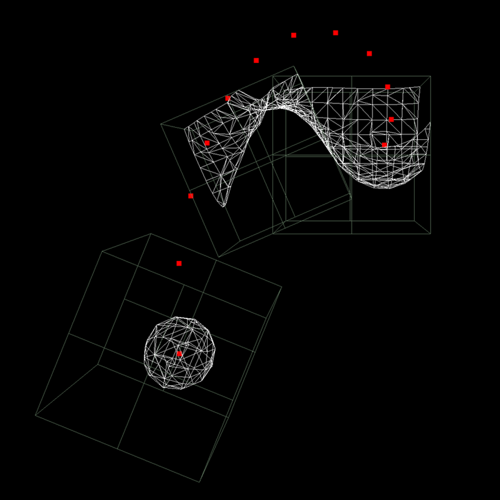

# MarchingCubes-Mac-OSX

Update:\
visit https://github.com/Kosalos/OSX-MarchingCubes \
for Swift 4.2 rendition, with all of algorithm done in the shader.

Written in Swift for Mac OSX.
Demonstration of the marching cubes algorithm, using compute shaders to do most of the work.
Three marching cubes work together to render the 3D mesh surrounding an array of moving points.

